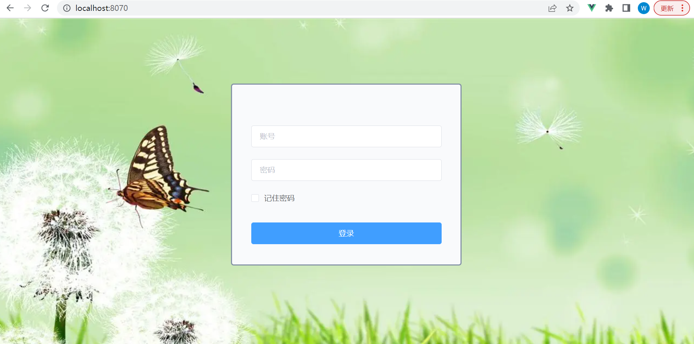
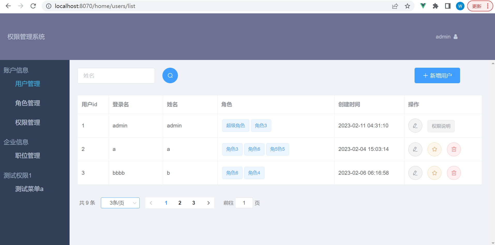
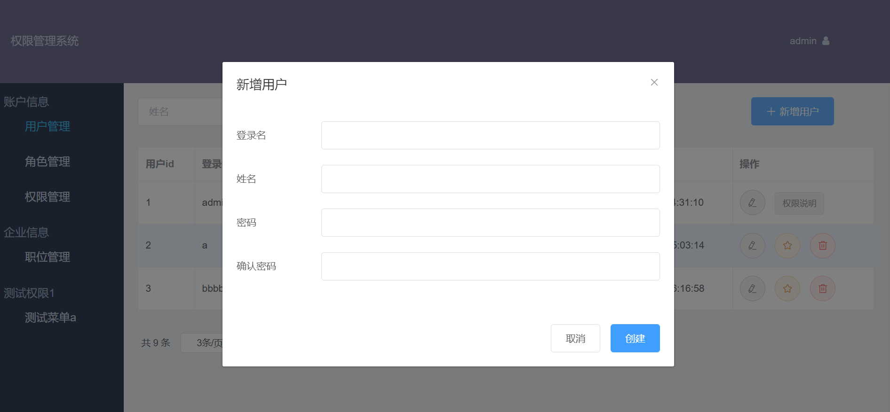
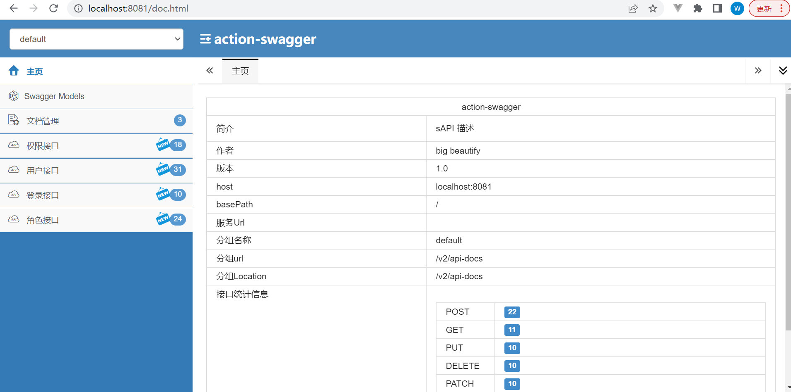

# springboot+vue
### 简介
```
是一套基于Vue全家桶（Vue2.x + Vue-router2.x + Vuex）+ springboot的前后端分离框架。
脚手架构建也可以通过vue官方的vue-cli脚手架工具构建
实现了一般后台所需要的权限管理功能，可根据实际业务增加业务页面

* 登录、退出登录
* 修改密码、记住密码
* 菜单管理
* 用户管理
* 角色管理
* 业务页面

### 开发依赖
* vue <https://vuefe.cn/v2/guide/>
* element-ui 2.10.1
* springboot 2.7.8 
* mybatisPlus 3.5.1 
* swagger 2
* mysql

### sql文件
在bless/miss/luck.sql

### 前端部署

部署前准备
1.安装node.js

完成以上两个步骤之后，进入miss这个目录,执行这2个命令，如果执行不了，请以管理员身份运行cmd命令窗口
npm install
npm run dev

前端设置了热部署

前端 端口号设置在config/index.js 为8070，可修改
前端调用后端的端口号设置在config/index.js 为8081（是后端的端口号） 可修改

```
### 项目页面






